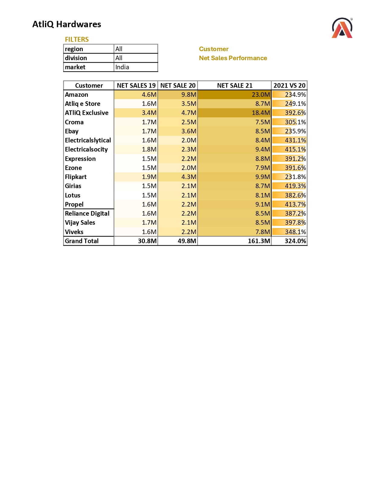

# Sales-and-Fiance-Analytics-Project-Excel
This project is a Sales &amp; Finance Analytics case study built in Microsoft Excel as part of my Data Analytics learning journey. I worked with real business-style datasets to clean, combine, and analyze sales + finance performance, then presented insights using Pivot Tables, Power Pivot, and interactive visuals for decision-making.

## 📌 Project Overview
AtliQ Hardwares needed clear visibility into **sales growth, customer performance, market targets, profitability trends, and P&L health**.  
This project focuses on transforming raw data into analysis-ready reporting that answers questions like:

- Which customers drove the highest growth from **2019–2021**?
- Which countries/markets are underperforming vs target?
- How stable is **Gross Margin %** across quarters and regions?
- What does monthly **P&L** reveal about financial health?

## 🎯 What This Project Covers
### Core Business Analysis
- **Net Sales Performance (Customer-level)** with YoY comparison (2019 → 2021)
- **Market vs Target analysis** across 20+ countries
- **Gross Margin % tracking** by quarters and sub-zones
- **P&L statements** by markets and fiscal months (Net Sales, COGS, Gross Margin, GM%)

### Extra Modules
- **Project Priority Matrix** (Quick Wins / Major Projects / Nice to Have / Maybe Later)

### 5) Customer Net Sales Performance

  

